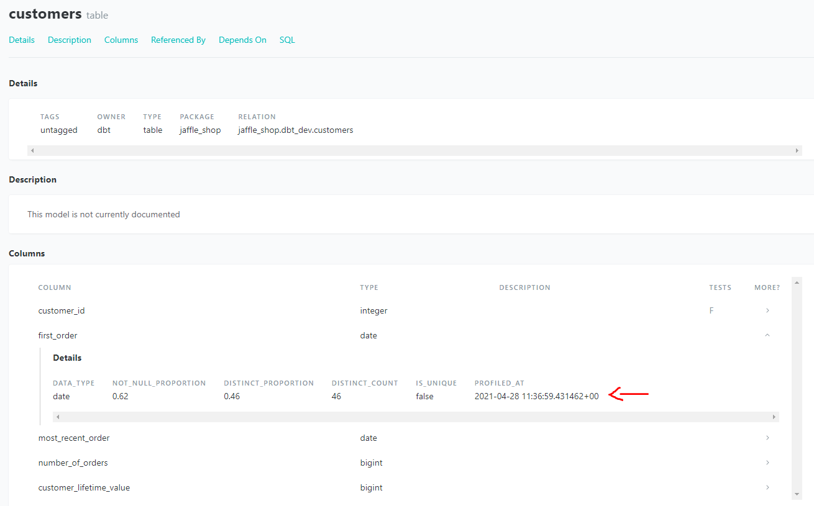

# dbt-profiler (beta)

**NOTE: This is a Work in Progress, please do not integrate any of the implemented macros with production workflows.**

Macros that profile dbt relation columns and create Markdown tables and model `schema.yml` definitions containing said profiles. The macros have been tested with `PostgreSQL` and `Snowflake`.

# Purpose 

`dbt-profiler` aims to provide the following:

1. `print_profile` macro for ad-hoc model profiling to support data exploration 
2. Describe a mechanism to include model profiles in [dbt docs](https://docs.getdbt.com/docs/building-a-dbt-project/documentation)

For the second point there are at least two options: `meta` properties and `doc` blocks. An example of the former is implemented in the [print_profile_schema](#print_profile_schema-source) macro. The latter can be achieved with the following pattern:

1. Use [print_profile](#print_profile-source) macro to generate the profile as a Markdown table
2. Copy the Markdown table to a `<model>.md` file
```
# customer.md


| column_name             | data_type | not_null_proportion | distinct_proportion | distinct_count | is_unique | profiled_at                   |
| ----------------------- | --------- | ------------------- | ------------------- | -------------- | --------- | ----------------------------- |
| customer_id             | integer   |                1.00 |                1.00 |            100 |      True | 2021-04-28 11:36:59.431462+00 |
| first_order             | date      |                0.62 |                0.46 |             46 |     False | 2021-04-28 11:36:59.431462+00 |
| most_recent_order       | date      |                0.62 |                0.52 |             52 |     False | 2021-04-28 11:36:59.431462+00 |
| number_of_orders        | bigint    |                0.62 |                0.04 |              4 |     False | 2021-04-28 11:36:59.431462+00 |
| customer_lifetime_value | bigint    |                0.62 |                0.35 |             35 |     False | 2021-04-28 11:36:59.431462+00 |


```
3. Include the profile in a model description using the `doc` macro
```yml
version: 2

models:
  - name: customer
    description: |
      Represents a customer.
      
      `dbt-profiler` results:

      {{ doc("dbt_profiler__customer") }}
    columns:
      - name: customer_id
        tests:
          - not_null
          - unique
```

# Contents
* [print_profile](#print_profile-source)
* [print_profile_schema](#print_profile_schema-source)
* [get_profile](#get_profile-source)

# Installation

New to dbt packages? Read more about them [here](https://docs.getdbt.com/docs/building-a-dbt-project/package-management/).
1. Include this package in your `packages.yml` file:
```yml
packages:
  - package: https://github.com/data-mie/dbt-profiler.git
    revision: 0.1.0
```
2. Run `dbt deps` to install the package.


# Macros

## print_profile ([source](macros/print_profile.sql))

This macro prints a relation profile as a Markdown table to `stdout`.

### Arguments
* `relation_name` (required): Relation name
* `schema` (optional): Relation schema name (default: target schema)
* `max_rows` (optional): The maximum number of rows to display before truncating the data
* `max_columns` (optional): The maximum number of columns to display before truncating the data
* `max_column_width` (optional): Truncate all columns to at most this width
* `max_precision` (optional): Puts a limit on the maximum precision displayed for number types (default: no limit)

### Usage
Call the macro as an [operation](https://docs.getdbt.com/docs/using-operations):
```bash
dbt run-operation print_profile --args '{"relation_name": "customers"}'
```

### Example output

| column_name             | data_type | not_null_proportion | distinct_proportion | distinct_count | is_unique | profiled_at                   |
| ----------------------- | --------- | ------------------- | ------------------- | -------------- | --------- | ----------------------------- |
| customer_id             | integer   |                1.00 |                1.00 |            100 |      True | 2021-04-28 11:36:59.431462+00 |
| first_order             | date      |                0.62 |                0.46 |             46 |     False | 2021-04-28 11:36:59.431462+00 |
| most_recent_order       | date      |                0.62 |                0.52 |             52 |     False | 2021-04-28 11:36:59.431462+00 |
| number_of_orders        | bigint    |                0.62 |                0.04 |              4 |     False | 2021-04-28 11:36:59.431462+00 |
| customer_lifetime_value | bigint    |                0.62 |                0.35 |             35 |     False | 2021-04-28 11:36:59.431462+00 |


## print_profile_schema ([source](macros/print_profile_schema.sql))

This macro prints a relation schema YAML to `stdout` containing all columns and their profiles.

### Arguments
* `relation_name` (required): Relation name
* `schema` (optional): Relation schema name (default: target schema)
* `model_description` (optional): Model description included in the schema
* `column_description` (optional): Column descriptions included in the schema

### Usage
Call the macro as an [operation](https://docs.getdbt.com/docs/using-operations):
```bash
dbt run-operation print_profile_schema --args '{"relation_name": "customers"}'
```

### Example output

```yaml
version: 2
models:
- name: customers
  description: ''
  columns:
  - name: customer_id
    description: ''
    meta:
      data_type: integer
      not_null_proportion: 1.0
      distinct_proportion: 1.0
      distinct_count: 100.0
      is_unique: true
      profiled_at: '2021-04-28 11:36:59.431462+00'
  - name: first_order
    description: ''
    meta:
      data_type: date
      not_null_proportion: 0.62
      distinct_proportion: 0.46
      distinct_count: 46.0
      is_unique: false
      profiled_at: '2021-04-28 11:36:59.431462+00'
  - name: most_recent_order
    description: ''
    meta:
      data_type: date
      not_null_proportion: 0.62
      distinct_proportion: 0.52
      distinct_count: 52.0
      is_unique: false
      profiled_at: '2021-04-28 11:36:59.431462+00'
  - name: number_of_orders
    description: ''
    meta:
      data_type: bigint
      not_null_proportion: 0.62
      distinct_proportion: 0.04
      distinct_count: 4.0
      is_unique: false
      profiled_at: '2021-04-28 11:36:59.431462+00'
  - name: customer_lifetime_value
    description: ''
    meta:
      data_type: bigint
      not_null_proportion: 0.62
      distinct_proportion: 0.35
      distinct_count: 35.0
      is_unique: false
      profiled_at: '2021-04-28 11:36:59.431462+00'
```

This what the profile looks like on the dbt docs site:

<p align="center">
 
</p>


## get_profile ([source](macros/get_profile.sql))

This macro returns a relation profile as an [agate.Table](https://agate.readthedocs.io/en/1.6.1/api/table.html#module-agate.table). The macro does not print anything to `stdout` and therefore is not meant to be used as a standalone [operation](https://docs.getdbt.com/docs/using-operations).

### Arguments
* `relation_name` (required): Relation name
* `schema` (optional): Relation schema name. If not specified, default target schema is used.

### Usage

Call this macro from another macro or dbt model:

```bash
{{ get_profile(relation_name="customers") }}
```